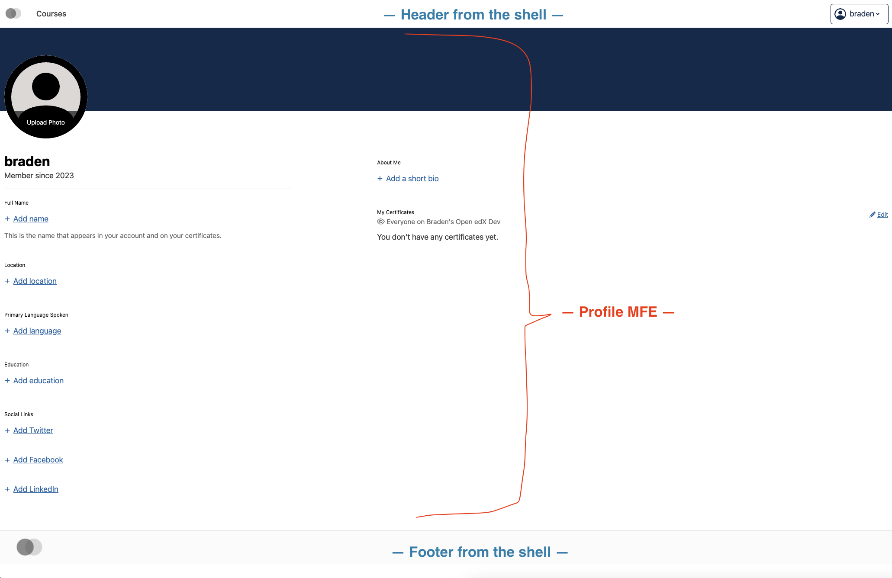
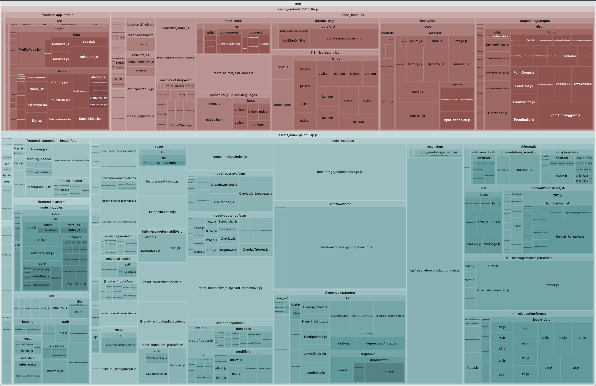

# Basic Frontend Shell Demo (with Vite)

## What this demonstrates

1. A "shell" app with header and footer, that can run different MFEs. So far only the `profile` and `learner-dashboard`
   MFEs are added though.
2. Everything is upgraded to use React 18. This required virtually no changes to anything, so I'm kind of suprised it
   hasn't been done yet.
   * I also enabled "strict mode" which is catching a few issues as console warnings that previously weren't caught.
2. `frontend-build` is not used at all, for any part of the process. In fact, the dependencies like
   `frontend-component-header` etc. are imported directly as source files, which can be `.jsx` or `.tsx` - we don't
   use/want the `dist` version of them. This allows better code-splitting, makes development easier, makes publishing
   easier, and (most importantly) allows only the "final" MFE (in this case the shell) to decide things like whether we
   need to include `core-js` or `@babel/runtime` or other stuff (we don't).
3. Full TypeScript support, anywhere you want to use it.
4. The dev server takes only ~100ms to start and has hot reloading support etc. The hot reloading detects changes in the
   shell, header, footer, and in the contained MFEs.
5. The production build (including full build and optimization of both MFEs, header, footer, Paragon SCSS, etc.) takes
   only **15 seconds**. (Compare to 41s for the current `profile` MFE and 74s for the `learner-dashboard` MFE, using
   frontend-build/webpack.)

## What this does NOT demonstrate

🛑 To be clear, this is not "module federation". It has some of the same benefits, but does not (currently) allow the
MFEs to be built or deployed _independently_ in production. Instead, this demo is essentially one super-MFE composed of
several different smaller MFEs, but they're all built at the same time. As it stands, each MFE could still be developed
and tested independently, but the production deployment process would involve rebuilding and re-deploying the whole
shell (which would take 1-2 minutes? On an M1 Macbook it takes ~28s for `npm ci` and ~15s for `npm run build` but
this would be slower on a CI container and as additional MFEs get added).

✅ It should still be possible to use "module federation" with this Vite-based approach, and gain the ability to deploy
each MFE independently - it simply requires setting up either
[`vite-plugin-federation`](https://www.npmjs.com/package/@originjs/vite-plugin-federation) or
[`@module-federation/vite`](https://www.npmjs.com/package/@module-federation/vite). However, I haven't yet tested these.
And what's more, I suspect that this approach would mean less efficient tree-shaking - for example, the Shell would
presumably include the full Paragon library, making the initial page load much slower. So there are trade-offs.

## What's shared in this demo

* Only one version of `react`, `react-dom`, `frontend-platform`, `paragon`, and `frontend-plugin-framework` is used, and
  it's the one provided by the shell.
* Paragon's overall SCSS rules are provided by the shell. (Each MFE can still provide its own SCSS and use Paragon
  variables and mixins but must be careful not to include the "main" Paragon rules, which would increase the build
  size and be redudnant.)
  - 🛑 Note: while building this, I found that `frontend-app-learner-dashboard` uses SCSS incorrectly and includes
    at least **ten** redundant copies of the paragon SCSS, which you can verify by going to https://home.edx.org/ and
    seeing, e.g. how many times the `.btn` rule is included. I fixed it in the submodule for this "shell" version, which
    includes only one `.btn` rule.
* The header and footer are provided by the shell.
  - 🛑 Note: this means that the totally different header normally used by `learner-dashboard` is not used.
* The overall `BrowserRouter` from `react-router` is provided by the shell.
* Overall initialization of `frontend-platform` and React are done by the shell, which includes setting up the
  [Auth Service and HTTP client](https://openedx.github.io/frontend-platform/module-Auth.html).
* The Logging and PubSub services from `frontend-platform` are initialized by the shell.

## What's unique to each MFE

* Each MFE provides its own Redux store and `Provider` if it uses Redux. There is no global/shared Redux store.
* Each MFE provides its own `IntlProvider` to make its localized messages available to all the components of that MFE.
  (Note: since we don't have a build step, currently the messages are not compiled - TODO: implement that).

## How to run (development mode)

1. Check out this repository and clone/update the submodules too.
2. Start a Tutor devstack, but not the `mfe` container (or, if you have the `mfe` container running, it must be
   configured with both the `frontend-app-profile` and `frontend-app-learner-dashboard` MFEs bind-mounted and their dev
   containers not running. Basically we don't want any other version of those MFEs running, as it conflicts with the
   ones in this shell.)
3. Install this repo's dependenies on your host with with `npm install`
4. Run this on your host with `npm run dev`
5. Access it at http://apps.local.overhang.io:1995/ or http://apps.local.edly.io:1995/ (likely only one of these will
   work, depending on your Tutor config - we need the CORS whitelist for that domain name.)

## Visualizing bundle result

Simply run `npx vite-bundle-visualizer` to produce this graph of the bundle components. In the screenshot below, green
is the `profile` MFE (it is labelled at the top), blue is the `learner-dashboard` MFE, the red "Helmet" contains all
dependencies that are used by either MFE but not by the shell itself, and the purple is the shell.

What you can see:
* Dependencies are tree-shaken and the bundles are optimized in a very smart way, to avoid duplication.
* Only one version of `react-dom.production.min.js` is loaded.
* _Four_ separate Paragon bundles are present, but it's because each bundle only loads the parts that it actually needs
  (tree-shaking). There should be no overlap for the actual files/component within each of the four bundles. That is,
  only one bundle will contain `Button`, only one contains `Dropdown`, and so on.
* 100 KB is for an `intl-relativetimeformat` polyfill that `frontend-platform` includes. TODO: remove it.
* 🛑 `lodash` is a huge dependency of learner-dashboard because of several imports of `@edx/react-unit-test-utils` 
  (specifically `useKeyedState` and `StrictDict`) in non-test code. TODO: fix it. 
* 🛑 `optimizely` is a huge dependency of learner-dashboard that should be dynamically imported only if enabled. TODO:
  fix.
* For some reason, Studio Header is included in the bundle (though it's tiny). I believe this is because it uses
  `ensureConfig()` at import time, so it cannot be tree-shaken out. TODO: fix that.
* `i18n-iso-languages` and `i18n-iso-countries` are rather large dependencies of `frontend-platform` that only appear
  in the profile MFE bundle. I think this is again because of tree-shaking. There is a long-standing TODO to load these
  dynamically rather than including all the languages in the bundle. TODO: that.

