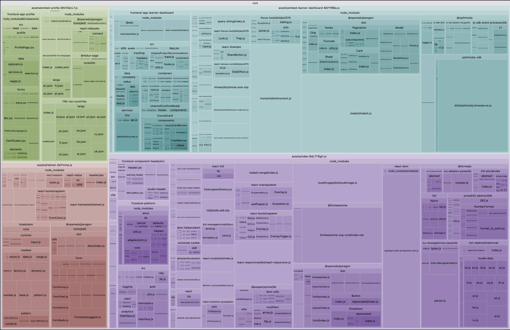

# Basic Frontend Shell Demo (with Vite)

## What this demonstrates

1. A "shell" app with header and footer, that can run different MFEs. So far only the `profile` MFE is added though.
2. Everything is upgraded to use React 18. This required virtually no changes to anything, so I'm kind of suprised it
   hasn't been done yet.
   * I also enabled "strict mode" which is catching a few issues as console warnings that previously weren't caught.
2. `frontend-build` is not used at all, for any part of the process. In fact, the dependencies like
   `frontend-component-header` etc. are imported directly as source files, which can be `.jsx` or `.tsx` - we don't
   use/want the `dist` version of them. This allows better code-splitting, makes development easier, makes publishing
   easier, and (most importantly) allows only the "final" MFE (in this case the shell) to decide things like whether we
   need to include `core-js` or `@babel/runtime` or other stuff (we don't).
3. Full TypeScript support, anywhere you want to use it.
4. The dev server takes only ~100ms to start and has hot reloading support etc. The hot reloading detects changes in the
   shell, header, footer, and in the contained MFEs.

## What's shared

* Only one version of `react`, `react-dom`, `frontend-platform`, and `paragon` is loaded.
* Paragon's overall SCSS rules are provided by the shell. (Each MFE can still provide its own SCSS and use Paragon
  variables and mixins but must be careful not to include the "main" Paragon rules, which would increase the build
  size and be redudnant.)
* The header and footer are provided by the shell.
* The overall `BrowserRouter` from `react-router` is provided by the shell.
* Overall initialization of `frontend-platform` and React are done by the shell, which includes setting up the
  [Auth Service and HTTP client](https://openedx.github.io/frontend-platform/module-Auth.html).
* The Logging and PubSub services from `frontend-platform` are initialized by the shell.

## What's unique to each MFE

* Each MFE provides its own Redux store and `Provider` if it uses Redux. There is no global/shared Redux store.
* Each MFE provides its own `IntlProvider` to make its localized messages available to all the components of that MFE.
  (Note: since we don't have a build step, currently the messages are not compiled - TODO: implement that).

## How to run (development mode)

1. Check out this repository and clone/update the submodules too.
2. Start a Tutor devstack, but not the `mfe` container (or, if you have the `mfe` container running, it must be
   configured with the `frontend-app-profile` bind-mounted and the `profile` container not running. Basically we don't
   want any version of the profile MFE running, as it conflicts with the profile MFE in this shell.)
3. Install this repo's dependenies on your host with with `npm install`
4. Run this on your host with `npm run dev`
5. Access it at http://apps.local.overhang.io:1995/ or http://apps.local.edly.io:1995/ (likely only one of these will
   work, depending on your Tutor config - we need the CORS whitelist for that domain name.)

## Visualizing bundle result

Simply run `npx vite-bundle-visualizer` to produce this graph of the bundle components. Note that `embed` (red) refers
to the profile MFE and `index` (green-blue) refers to the shell.

What you can see:
* Only one version of `react-dom.production.min.js` is loaded.
* _Two_ versions of Paragon are present, but it's because each part (shell, profile) only loads the parts that it
  actually needs (tree-shaking). There seems to be no overlap between them.
  TODO: investigate how to tell Vite to include _all_ of Paragon in the shell bundle proactively.
* 100 KB is for an `intl-relativetimeformat` polyfill that `frontend-platform` includes. TODO: remove it.
* For some reason, Studio Header is included in the bundle (though it's tiny).
* `i18n-iso-languages` and `i18n-iso-countries` are rather large dependencies of `frontend-platform` that only appear
  in the profile MFE bundle. I think this is again because of tree-shaking. There is a long-standing TODO to load these
  dynamically rather than including all the languages in the bundle. TODO: that.

